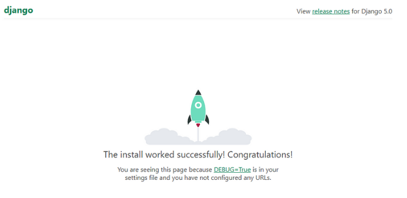
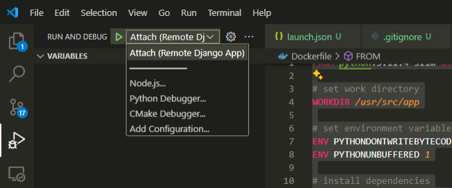
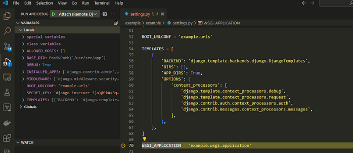

# Debugging Django (Python) Dockerized applications

Example code on how to run a Django app in a docker container and debug it with VSCode python debugger.

Full explanation at https://medium.com/@davivc/debugging-django-python-dockerized-applications-ff8ba843e6dd


## A. Running the application the first time

These commands will build, migrate and start the example Django application

### 1. Build the application

```bash
docker-compose build
```

### 2. Start the application

```bash
docker-compose up
```

### 3. Migrate the database

In a new terminal run
```bash
docker-compose exec example python manage.py migrate --noinput
```

### 4. Access the application

Go to http://localhost:8000/



## B. Debugging the application

To debug the application just run the service on debug mode (stop the service started previously to avoid port conflict).

```bash
docker-compose up example-debug
```

Attach the Vscode Python Debugger defined on `launch.json`.



Add some breakpoints and start debugging.

